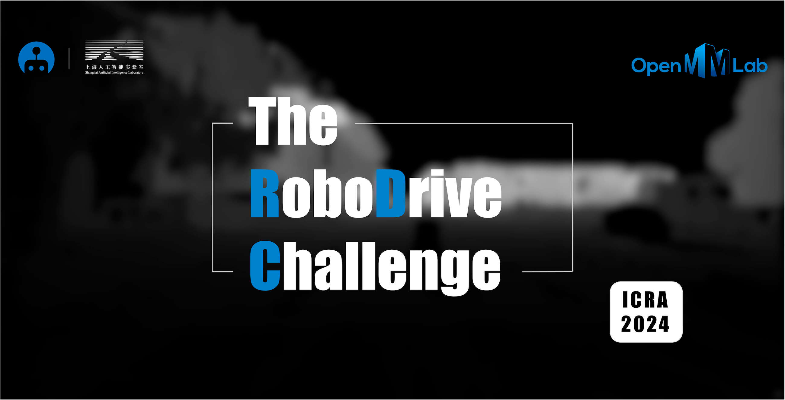

# RoboDrive Toolkit
[](https://twitter.com/RoboDrive2024)
[](https://robodrive-24.github.io/)
[](https://join.slack.com/t/robodrive/shared_invite/zt-29fnp2iye-QZtwxSdCchil6noIiTxoXg)
[](https://robodrive-24.github.io/wechat_qr.jpg)

[](https://2024.ieee-icra.org/)

<p align="center">
  
</p>

Welcome to [The RoboDrive Challenge](https://robodrive-24.github.io/)! :wave:


## :oncoming_automobile: About
> `RoboDrive` is one of the first competitions that targeted probing the Out-of-Distribution (OoD) robustness of state-of-the-art autonomous driving perception models, centered around two mainstream topics: **common corruptions** and **sensor failures**.

> There are eighteen real-world corruption types in total, ranging from three perspectives:
>  - Weather and lighting conditions, such as bright, low-light, foggy, and snowy conditions.
>  - Movement and acquisition failures, such as potential blurs caused by vehicle motions.
>  - Data processing issues, such as noises and quantizations happen due to hardware malfunctions.

> Additionally, we aim to probe the 3D scene perception robustness under camera and LiDAR sensor failures:
>  - Loss of certain camera frames during the driving system sensing process.
>  - Loss of one or more camera views during the driving system sensing process.
>  - Loss of the roof-top LiDAR view during the driving system sensing process.

> Kindly visit the `RoboDrive` [webpage](https://robodrive-24.github.io/) to explore more details and instructions of this challenge. :blue_car:

## :rainbow: Venue

> This competition is affiliated with the 41st IEEE Conference on Robotics and Automation ([ICRA 2024](https://2024.ieee-icra.org/)).

><br/>

> ICRA is the IEEE Robotics and Automation Society's flagship conference. ICRA 2024 will be held from May 13th to 17th, 2024, in Yokohama, Japan.

> The ICRA competitions provide a unique venue for state-of-the-art technical demonstrations from research labs throughout academia and industry. For additional details, kindly refer to the ICRA 2024 [website](https://2024.ieee-icra.org/).


# Outline
- [Changelog](#memo-changelog)
- [Useful Info](#information_source-useful-info)
- [Timeline](#clock1-timeline)
- [Challenge Tracks](#blue_car-challenge-tracks)
- [Awards](#1st_place_medal-awards)
- [Data Preparation](#hotsprings-data-preparation)
- [Getting Started](#rocket-getting-started)
- [Citation](#citation)
- [License](#license)
- [Sponsor](#heart-sponsor)
- [Terms & Conditions](#balance_scale-terms--conditions)
- [Frequently Asked Questions](#thinking-frequently-asked-questions)
- [Acknowledgements](#ok_man-acknowledgements)


## :memo: Changelog
- `Jan 08 '24` - A list of *Frequently Asked Questions* has been summarized on [this](https://github.com/robodrive-24/toolkit/blob/main/docs/GET_STARTED.md#frequently-asked-questions
) page.
- `Jan 06 '24` - Instructions, baseline models, and results of Tracks `1` to `3` have been released.
- `Jan 05 '24` - Training and evaluation data of Tracks `1` to `4` have been released.
- `Dec 25 '23` - Register for your team by filling in [this](https://forms.gle/hnaezVhEycPAjUD78) Google Form.
- `Dec 01 '23` - Launch of [The RoboDrive Challenge](https://robodrive-24.github.io/) at [ICRA 2024](https://2024.ieee-icra.org/). More info coming soon!


## :information_source: Useful Info
| \# | Item | Link |
|:-:|:-|:-|
| :globe_with_meridians: | Competition Webpage | https://robodrive-24.github.io |
| :wrench: | Competition Toolkit | https://github.com/robodrive-24/toolkit |
| :octocat: | Official GitHub Account | https://github.com/robodrive-24 |
| :mailbox: | Contact | robodrive.2024@gmail.com |


## :clock1: Timeline
> **Note:** All timestamps are in the `AoE` (Anywhere on Earth) format.
- `Dec 25 '23` - Team Up; Register for your team by filling in [this](https://forms.gle/hnaezVhEycPAjUD78) Google Form. 
- `Jan 05 '24` - Release of training and evaluation data.
- `Jan 15 '24` - Competition servers online @ [EvalAI](https://eval.ai/).
- `Mar 31 '24` - Phase `One` deadline.
- `Apr 30 '24` - Phase `Two` deadline.
- `May 17 '24` - Award decision announcement @ [ICRA 2024](https://2024.ieee-icra.org/).


## :blue_car: Challenge Tracks
There are **five** tracks in this `RoboDrive` challenge, with emphasis on the following 3D scene perception tasks:

| \# | Task | Description | Doc | Server |
|:-:|:-|:-|:-:|:-:|
| Track `1` | Robust BEV Detection | Evaluating the resilience of detection algorithms against diverse environmental and sensor-based corruptions | [`[Link]`](https://github.com/robodrive-24/toolkit/blob/main/track-1/README.md) | [Link] |
| Track `2` | Robust Map Segmentation | Focusing on the segmentation of complex driving scene elements in BEV maps under varied driving conditions | [`[Link]`](https://github.com/robodrive-24/toolkit/blob/main/track-2/README.md) | [Link] |
| Track `3` | Robust Occupancy Prediction | Testing the accuracy of occupancy grid predictions in dynamic and unpredictable real-world driving environments | [`[Link]`](https://github.com/robodrive-24/toolkit/blob/main/track-3/README.md) | [Link] |
| Track `4` | Robust Depth Estimation | Assessing the depth estimation robustness from multiple perspectives for comprehensive 3D scene perception | [`[Link]`](https://github.com/robodrive-24/toolkit/blob/main/track-4/README.md) | [Link] |
| Track `5` | Robust Multi-Modal BEV Detection | Tailored for evaluating the reliability of advanced driving perception systems equipped with multiple types of sensors | [`[Link]`](https://github.com/robodrive-24/toolkit/blob/main/track-5/README.md) | [Link] |


## :1st_place_medal: Awards
To be announced.


## :hotsprings: Data Preparation
Kindly refer to [DATA_PREPARE.md](docs/DATA_PREPARE.md) for the details to prepare the training and evaluation data.


## :rocket: Getting Started
Kindly refer to [GET_STARTED.md](docs/GET_STARTED.md) to learn more usage of this toolkit.


## Citation
If you find this competition helpful for your research, please kindly consider citing our papers:

```bibtex
@article{xie2023robobev,
    title = {RoboBEV: Towards Robust Bird's Eye View Perception under Corruptions},
    author = {Shaoyuan Xie and Lingdong Kong and Wenwei Zhang and Jiawei Ren and Liang Pan and Kai Chen and Ziwei Liu},
    journal = {arXiv preprint arXiv:2304.06719}, 
    year = {2023}
}
```

```bibtex
@inproceedings{kong2023robodepth,
    title = {RoboDepth: Robust Out-of-Distribution Depth Estimation under Corruptions},
    author = {Lingdong Kong and Shaoyuan Xie and Hanjiang Hu and Lai Xing Ng and Benoit R. Cottereau and Wei Tsang Ooi},
    booktitle = {Advances in Neural Information Processing Systems (NeurIPS)},
    year = {2023},
}
```

```bibtex
@inproceedings{kong2023robo3d,
    title = {Robo3D: Towards Robust and Reliable 3D Perception against Corruptions},
    author = {Lingdong Kong and Youquan Liu and Xin Li and Runnan Chen and Wenwei Zhang and Jiawei Ren and Liang Pan and Kai Chen and Ziwei Liu},
    booktitle = {Proceedings of the IEEE/CVF International Conference on Computer Vision (ICCV)},
    pages = {19994--20006},
    year = {2023},
}
```


## License
<a rel="license" href="http://creativecommons.org/licenses/by-nc-sa/4.0/"></a>
<br />
This competition is under the <a rel="license" href="http://creativecommons.org/licenses/by-nc-sa/4.0/">Creative Commons Attribution-NonCommercial-ShareAlike 4.0 International License</a>.


## :heart: Sponsor
To be updated.


## :balance_scale: Terms & Conditions
This competition is made freely available to academic and non-academic entities for non-commercial purposes such as academic research, teaching, scientific publications, or personal experimentation. Permission is granted to use the data given that you agree:
1. That the data in this competition comes “AS IS”, without express or implied warranty. Although every effort has been made to ensure accuracy, we do not accept any responsibility for errors or omissions.
2. That you may not use the data in this competition or any derivative work for commercial purposes such as, for example, licensing or selling the data, or using the data with a purpose of procuring a commercial gain.
3. That you include a reference to RoboDrive (including the benchmark data and the specially generated data for academic challenges) in any work that makes use of the benchmark. For research papers, please cite our preferred publications as listed on our webpage.

To ensure a fair comparison among all participants, we require:
1. All participants must follow the exact same data configuration when training and evaluating their algorithms. Please do not use any public or private datasets other than those specified for model training.
2. The theme of this competition is to probe the out-of-distribution robustness of autonomous driving perception models. Therefore, any use of the corruption and sensor failure types designed in this benchmark is strictly prohibited, including any atomic operation that comprises any one of the mentioned corruptions.
3. To ensure the above two rules are followed, each participant is requested to submit the code with reproducible results before the final result is announced; the code is for examination purposes only and we will manually verify the training and evaluation of each participant's model.


## :thinking: Frequently Asked Questions

| | |
|:-:|:-|
| :thinking: | **Q1:** ***"How can I register a valid team for this competition?"*** |
| :blue_car: | **A1:**  To register a team, kindly fill in [this](https://forms.gle/hnaezVhEycPAjUD78) Google Form. The registration period is from `now` till the deadline of phase one, i.e., `Mar 31 '24`. |
|  |
|  |
| :thinking: | **Q2:** ***"Are there any restrictions for the registration? For example, the number of team members."*** |
| :blue_car: | **A2:**  Each team leader should make a **valid** registration for his/her team. Each participant can only be registered by **one** team. This is no restriction on the number of team members in a team.
|  |
|  |
| :thinking: | **Q3:** ***"Whether team members can be changed during the competition?"*** |
| :blue_car: | **A3:**  No. You **CANNOT** change the list of team members after the registration. You must register again as a **new** team if you need to add or remove any members of your team. |
|  |
|  |
| :thinking: | **Q4:** ***"How many tracks can I participate in?"*** |
| :blue_car: | **A4:**  Each team can participate in **at most two tracks** in this competition. |
|  |
|  |
| :thinking: | **Q5:** ***"What can I expect from this competition?"*** |
| :blue_car: | **A5:**  We provide the winning teams from each track with **cash awards** :moneybag: and **certificates** :1st_place_medal:. The winning solutions will be summarized as a **technical report** :book:. An example of last year's technical report can be found [here](https://arxiv.org/abs/2307.15061).
|  |
|  |
| :thinking: | **Q6:** ***“Can I use additional data resources for model training?"*** |
| :blue_car: | **A6:**  No. All participants must follow the **SAME** data preparation procedures as listed in [DATA_PREPARE.md](https://github.com/robodrive-24/toolkit/blob/main/docs/DATA_PREPARE.md). Additional data sources are **NOT** allowed in this competition.
|  |
|  |
| :thinking: | **Q7:** ***"Can I use corruption augmentations during model training?"*** |
| :blue_car: | **A7:**  No. The theme of this competition is to probe the **out-of-distribution robustness** of autonomous driving perception models. Therefore, all participants must **REFRAIN** from using any corruption simulations as data augmentations during the model training, including any atomic operation that comprises any one of the corruptions in this competition.
|  |
|  |
| :thinking: | **Q8:** ***"How should I configurate the model training? Are there any restrictions on model size, image size, loss function, optimizer, number of epochs, and so on?"***
| :blue_car: | **A8:**  We provide one **baseline model** for each track in [GET_STARTED.md](https://github.com/robodrive-24/toolkit/blob/main/docs/GET_STARTED.md). The participants are recommended to refer to these baselines as the starting point in configuring the model training. There is no restriction on normal model training configurations, including model size, image size, loss function, optimizer, and number of epochs. 
|  |
|  |
| :thinking: | **Q9:** ***"Can I use LiDAR data for Tracks `1` to `4`?"*** |
| :blue_car: | **A9:**  No. Tracks `1` to `4` are **single-modality** tracks that only involve the use of camera data. The goal of these tracks is to probe the robustness of perception models under camera-related corruptions. Participants who are interested in **multi-modal robustness** (camera + LiDAR) can refer to Track `5` in this competition.
|  |
|  |
| :thinking: | **Q10:** ***"Is it permissible to use self-supervised model pre-training (such as MoCo and MAE)?"*** |
| :blue_car: | **A10:**  Yes. The use of **self-supervised** pre-trained models is possible. Such models may include [MoCo](https://arxiv.org/abs/1911.05722), [MoCo v2](https://arxiv.org/abs/2003.04297), [MAE](https://arxiv.org/abs/2111.06377), [DINO](https://github.com/facebookresearch/dino), and many others. Please make sure to acknowledge (in your code and report) if you use any pre-trained models.
|  |
|  |
| :thinking: | **Q11:** ***"Can I use large models (such as SAM) to generate pre-training or auxiliary annotations?"*** |
| :blue_car: | **A11:**  No. The use of large foundation models, such as [CLIP](https://github.com/openai/CLIP), [SAM](https://segment-anything.com/), [SEEM](https://github.com/UX-Decoder/Segment-Everything-Everywhere-All-At-Once), and any other similar models, is **NOT** allowed in this competition. This is to ensure a relatively fair comparing environment among different teams. Any violations of this rule will be regarded as **cheating** and the results will be canceled.
|  |
|  |
| :thinking: | **Q12:** ***"Are there any restrictions on the use of pre-trained weights (such as DD3D, ImageNet, COCO, ADE20K, Object365, and so on)?"*** |
| :blue_car: | **A12:**  To be updated.
|  |
|  |
| :thinking: | **Q13:** ***"Can I combine the training and validation sets for model training?"*** |
| :blue_car: | **A13:**  [Updated]. It is strictly **NOT** allowed to use the validation data for model training. All participants **MUST** follow the nuScenes official `train` split during model training and **REFRAIN** from involving any samples from the validation set. Any violations of this rule will be regarded as **cheating** and the results will be canceled.
|  |
|  |
| :thinking: | **Q14:** ***"Can I use model ensembling and test-time augmentation (TTA)?"*** |
| :blue_car: | **A14:**  Like many other academic competitions, it is possible to use **model ensembling** and **test-time augmentation (TTA)** to enhance the model when preparing the submissions. The participants **SHOULD** include necessary details for the use of model ensembling and TTA in their code and reports.
|  |
|  |
| :thinking: | ... |
| :blue_car: | ... |

### Contact
:mailbox: Didn't find a related FAQ to your questions? Let us know (robodrive.2024@gmail.com)!


## :ok_man: Acknowledgements
This competition is developed based on the [RoboBEV](https://github.com/Daniel-xsy/RoboBEV), [RoboDepth](https://github.com/ldkong1205/RoboDepth), and [Robo3D](https://github.com/ldkong1205/Robo3D) projects.

This competition toolkit is developed based on the [MMDetection3D](https://github.com/open-mmlab/mmdetection3d) codebase.

><br/>
> MMDetection3D is an open-source toolbox based on PyTorch, towards the next-generation platform for general 3D perception. It is a part of the OpenMMLab project developed by MMLab.

The evaluation sets of this competition are constructed based on the [nuScenes](https://www.nuscenes.org/nuscenes) dataset from [Motional AD LLC](https://motional.com/).

Part of the content of this toolkit is adopted from [The RoboDepth Challenge](https://robodepth.github.io/) @ [ICRA 2023](https://www.icra2023.org/).
